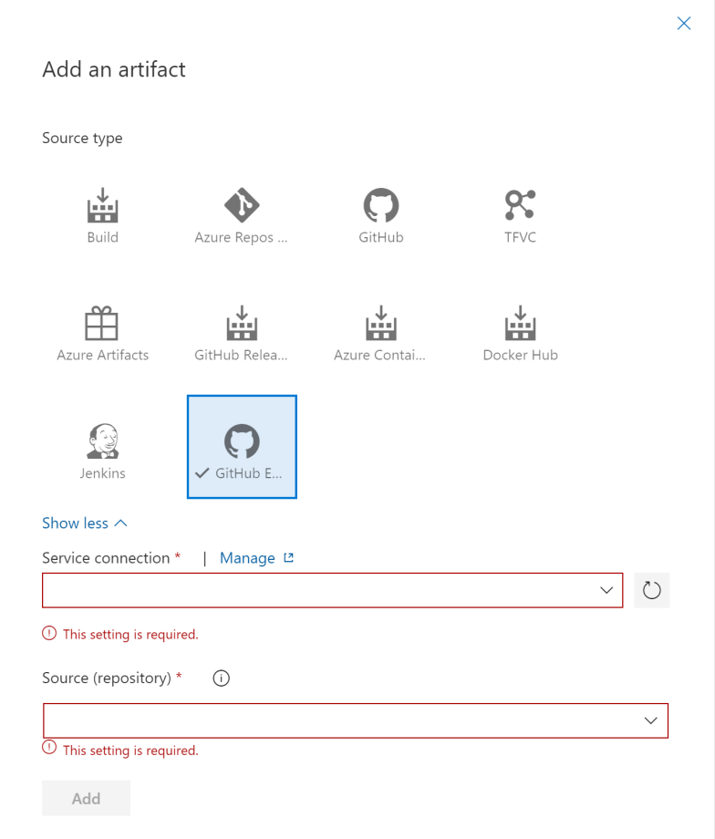

# GitHub Enterprise artifact for Release Pipelines
This extension provides a native integration experience for GitHub Enterprise Server when leveraging Release Pipelines, this integration is implemented as a custom Release Artifact.

Prior to the release of this extension Release Pipelines supported only Github.com as a release artifact. This meant that the only way to leverage artifacts originating directly from GitHub Enterprise Server during a release was to add a step to manually clone the repository using the Git CLI.  

## Team Foundation Server 2018 & Azure DevOps Server 2019 Support
The extension which is published to the marketplace is supported for the Azure DevOps Service target only. If you wish to install this extension on TFS 2018 or ADO Server 2019 please download the latest server VSIX package i.e. soft-cor.githubenterprise-custom-release-artifact-server-extension-[version].vsix from the [GitHub Releases](https://github.com/keyoke/GithubEnterpriseServerRMArtifact/releases).

## Usage
This extension requires you to first configure a service connection to connect to your GitHub Enterprise server. Once connected, you can link a source artifact from the a GitHub Enterprise Server repository and use these artifacts in your Release Pipeline.

### Connecting to GitHub Enterprise
Go to project settings -> Services Connections tab and create a New Service Connection of type GitHub Enterprise Server.

The authentication scenarios which are currently supported by the extension are :
* Personal Access Token
* Username & Password

If your GitHub Enterprise server is deployed on a private cloud behind a firewall and the Azure DevOps Service does not have line of sight to the server you must skip the "Verify Connection" step.

### Linking a GitHub Enterprise artifact
Once you have set up the service connection, you will be able to link to a GitHub Enterprise Server artifact in your release definition.

Once you have selected the Service Connection, you will be able to select the relevant repository from the pre-populated repository drop-down. You will also be asked to select the branch as well as version details.

## TODO
The following functionality is not yet implemented.

* Add support for OAuth Authentication
* Add Git-LFS support
* Add Support for Azure DevOps Server
